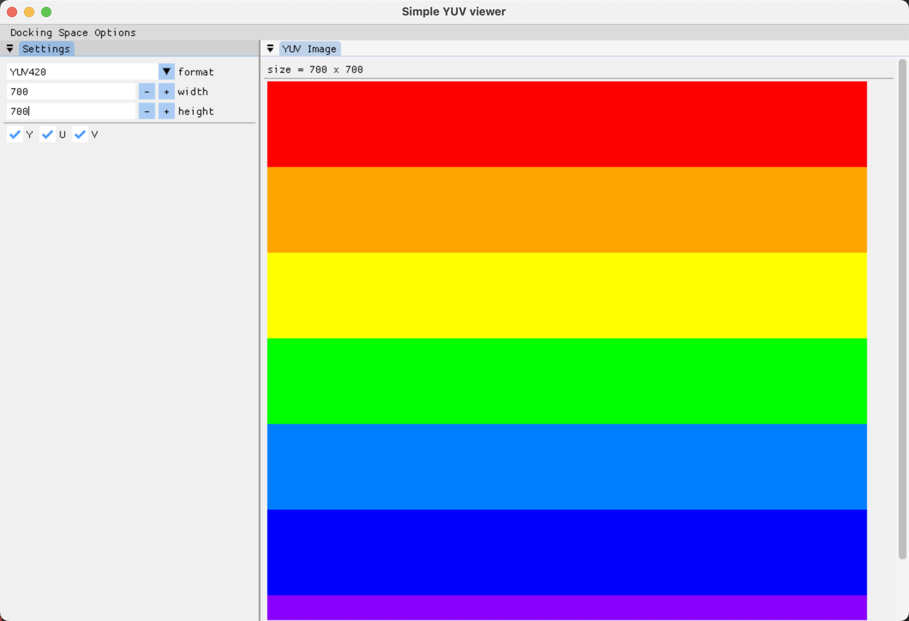

# Simple YUV Viewer
Simple YUV Viewer is a imgui based, cross-platform YUV view tool.


# Build
+ On Mac OS X
```shell
brew install sdl2
git clone https://github.com/jiemojiemo/simple_yuv_viewer
cd simple_yuv_viewer
git submodule update --init --recursive
cmake -S . -B build
cmake --build build
```


